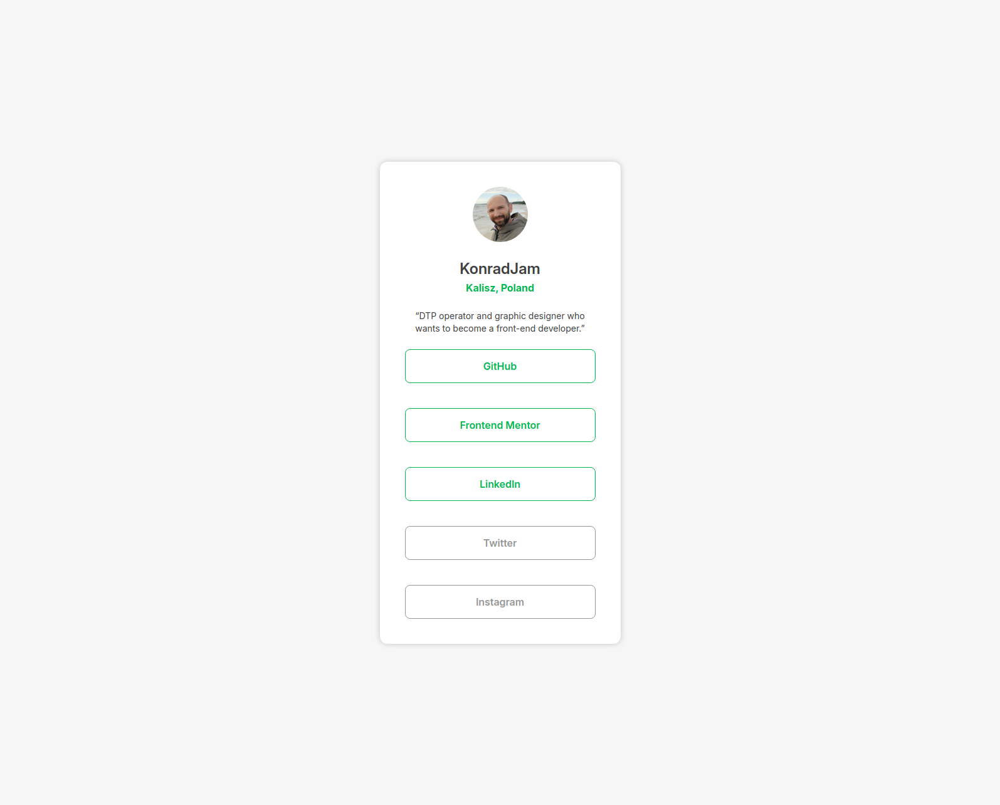

# Frontend Mentor - Social links profile solution

This is a solution to the [Social links profile challenge on Frontend Mentor](https://www.frontendmentor.io/challenges/social-links-profile-UG32l9m6dQ).

## Table of contents 

- [Overview](#overview)
    - [Screenshot](#screenshot)
    - [Links](#links)
- [My process](#my-process)
    - [Built with](#built-with)
- [Author](#author)

## Overview

### Screenshot

### Links

Live Site URL: [GitHub Pages](https://konradjam.github.io/social-links-profile-main/)

## My process

### Built with

- Semantic HTML 5 markup
- CSS custom properties
- Flexbox
- Mobile-first workflow
- Clamp()

## Author

- LinkedIn [KonradJam](www.linkedin.com/in/konrad-jam-61a98b2b6)
- Frontend Mentor [KonradJam](https://www.frontendmentor.io/profile/KonradJam)
- Codewars [KonradJam](https://www.codewars.com/users/KonradJam)
- CodePen [KonradJam](https://codepen.io/acidburnpl)